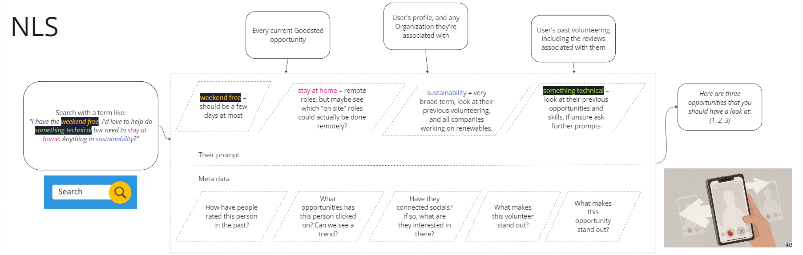

# OCA - Exploration playground

## Natural Language Search with NLP - NLS

Lead: @vrushaliashok

### Why

Search bars don't work well on any site, least of all when it's something as nuanced and emotional as volunteering.

### How

Make searching more intuitive and intelligent, releasing the effort/load from the volunteer and instead learning and understanding what the volunteer is really looking for based on previous experiences and NLP.

### What

Goodsted introduces a user-friendly search feature that utilizes Natural Language Processing (NLP) to match concepts instead of just keywords. This approach makes searching for opportunities more intuitive and precise. Whether it's finding relevant opportunities based on specific preferences or exploring broader themes, the NLP-powered search ensures that users discover opportunities that align with their interests. This feature benefits users across different platforms, from documentation sites to marketplaces, providing a more efficient and concept-focused search experience.

## Rough idea?

